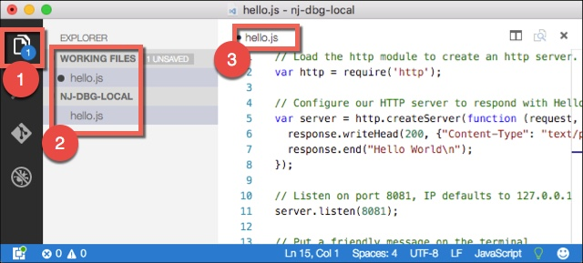
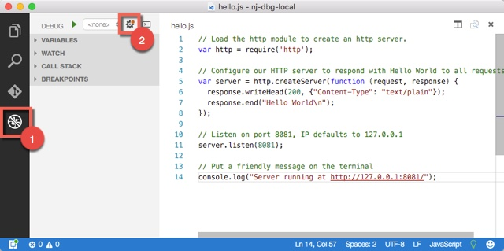
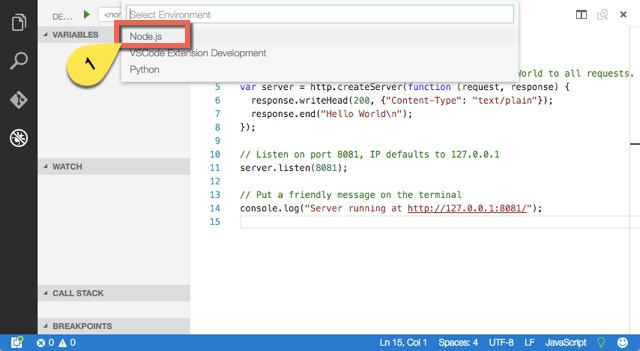
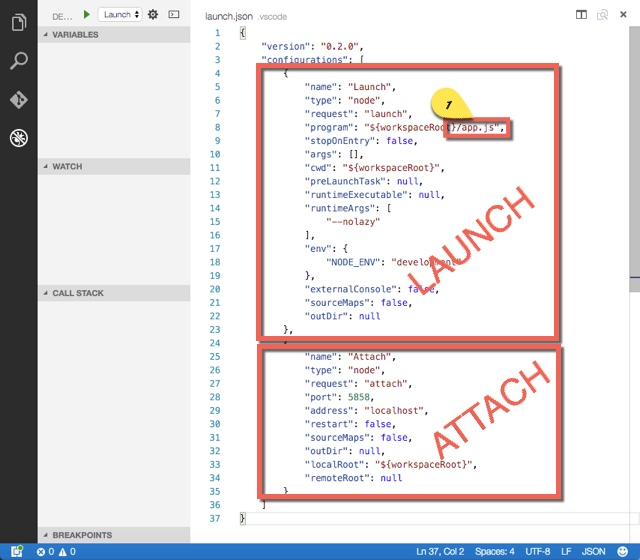
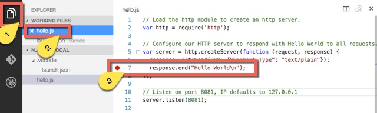
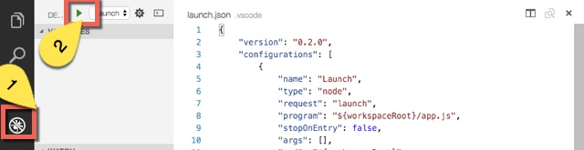
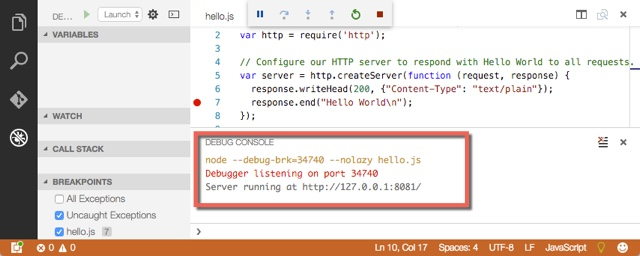
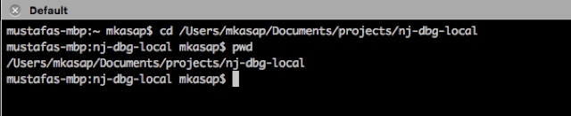
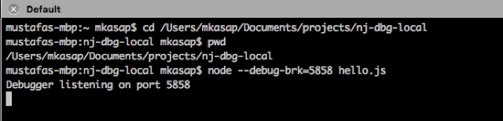
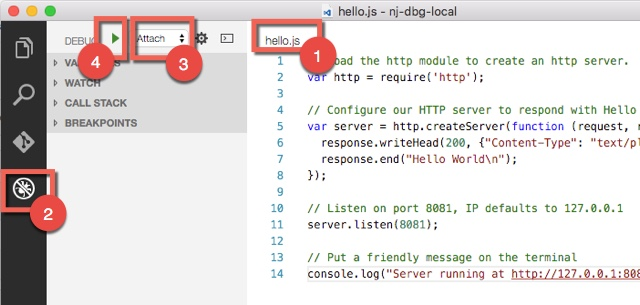

#NJ 01 - Locally Debug Node.js with Visual Studio Code

##Platforms:

Windows, Mac, Linux

##Requirements:

- Install node.js (https://nodejs.org)

- Install Visual Studio Code (https://code.visualstudio.com)

 
##Debugging:
Two types of local debugging possibility for a node.js app on Visual Studio Code: Attach or Launch.
 

###**Debugging by launching a new instance:**
1. Create an empty folder name it i.e. **"nj-dbg-local"**

2. **Run** Visual Studio Code. From **File** menu, click **Open** to open **Select File** dialog window.  In the **Select File** dialog window select the empty folder name (which is **"nj-dbg-local"**) that you just created and click **Open**. Now our working folder is set to "nj-dbg-local"

3. Create a new file in our working directory: From **File** menu, click **New File**. Copy/Paste the below node.js code into the new file that is open in the editor.
```node
  // Load the http module to create an http server. 
  var http = require('http'); 

  // Configure our HTTP server to respond with Hello World to all requests. 
  var server = http.createServer(function (request, response) {  
     response.writeHead(200, {"Content-Type": "text/plain"});  
     response.end("Hello World\n"); 
  }); 

  // Listen on port 8081, IP defaults to 127.0.0.1 
  server.listen(8081); 

  // Put a friendly message on the terminal 
  console.log("Server running at http://127.0.0.1:8081/");
```

4. Save the file with a name i.e. hello.js Until now there is only one file (which is hello.js) in the working folder.  
  

5. Switch to the **debug tab**. Click on the **settings icon** that is highlighted on the below screenshot.  
  

6. Select "**Node.js**" in the dropdown list. This will create a new file named **launch.json** in the working directory (with hidden system file attribute, so not visible unless you set explorer settings to show all files.) and the file will open in the editor.  
  

7. **launch.json** file has two sections in it: **launch** and **attach**. We will work on the launch section. In this section change the **app.js** parameter to **hello.js** So the corresponding code line will be:  
**"program": "${workspaceRoot}/hello.js",**  
  

8. Switch back to file explorer tab and click on hello.js to open the hello.js file. Click on to the left of line 7 to put a break point (red dot) as shown on the below screenshot.  
  

9. Now again switch back to debug tab and click on the RUN button.  
  

10. You will see the Debug Console and a message "Debugger listening on port..."  
  

11. Now open a browser and type http://127.0.0.1:8081/ on the address bar. You will notice that the execution broken on the breakpoint set in step 8. At this point you can continue code execution, execute line by line or watch any variable, application stack etc.

###**Debugging by attaching to an existing instance:**
1. In step 7. of the previous section, two different debugging modes and their settings in **launch.json** file mentioned. In the **attach** section of the **launch.json** file, there is a line starts with "port...". Actually it is exactly:  
**"port": 5858,**  
which means the debugger will attach to port 5858 to listen node.js app execution. It is important to note that this port (5858) is different then the http port (8081) that we create inside the node.js app to listen http requests. Either keep the default value 5858 as it is or update with another port number, but use same port number in step 3 below.

2. Launch a terminal window. Change working directory to "nj-dbg-local", so current working directory is "nj-dbg-local".
  

3. Launch a new node session with the hello.js file on port 5858 with following command line.  
**node --debug-brk=5858 hello.js**  
here **--debug-brk** parameter sets the node app to break on the execution of the first line and **=5858** sets the port to be used (otherwise it will use another default port). This port number has to be same with the one mentioned in step 1.
  

4. Now switch back to Visual Studio Code, open hello.js file and on the debug menu select "**attach**" and press **RUN** button.  
  

5. When you click the **RUN** button at the previsous step, the execution will start and will break at the first line. Afterwards you can continue execution or monitor variables, stack etc.  
